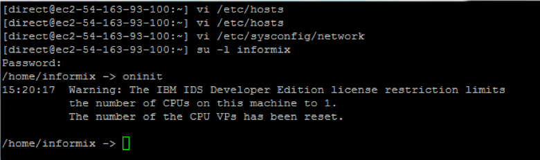
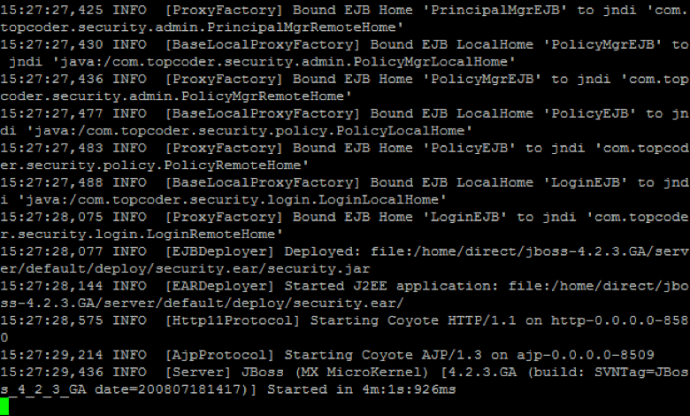
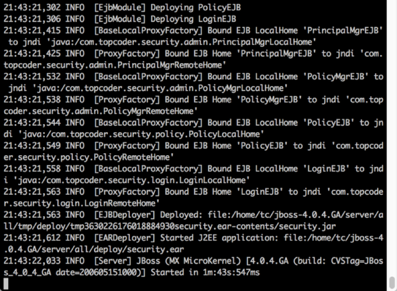

By default, TC VM is configured to use internal domain name which cannot be resolved from the outside. So you need to change the host name to the public domain.

## Update Host Name
First of all, you need to know your public domain. By default, the format of public domain name is like `ec2-<VM IP>.compute-1.amazonaws.com`, where you replace <VM IP> with the public IP of your VM, using dash to separate the 4 numbers instead of dot. For example, my VM’s IP is `50.16.55.96`, then its public domain name is `ec2-50-16-55-96.compute-1.amazonaws.com`.

1. Login to your VM as `root`
2. Edit `/etc/sysconfig/network` file, and set `HOSTNAME` to your public domain name.
```
HOSTNAME=ec2-50-16-55-96.compute-1.amazonaws.com
```
3. Restart your VM, using `/sbin/shutdown -r now`.

After the VM is restarted, all the applications are not running because they do not start automatically. You need to manually start them. For this challenge, you only need to start informix, direct, and apache.

## Start Apache Server
1. Login VM as `root` user. 
2. Run `/usr/local/apache/bin/apachectl start` to start apache.

## Start Informix
1. Login VM as `root`. 
2. Switch to `informix` user - `su - informix`
3. Start the informix server - `oninit`. You should see something similar to the below screenshot.

 
## Start JBoss for Direct
1. Login VM as `root`. 
2. Swtich to `direct` - `su - direct`
3. Go to jboss bin directory - `jbb`
4. Start the jboss service - `./start.sh`
The JBoss should be starting. You can use “tn” to check the log. Wait until the application is running. It may take several minutes.


## Start JBoss for legacy website
1. Login VM as `root`. 
2. Swtich to `tc` user - `su - tc`
3. Go to jboss bin directory - `jbb`
4. Start the jboss service - `./start.sh`
You can use “tn” to check the log. Wait until the application finishes starting. It may take several minutes.


